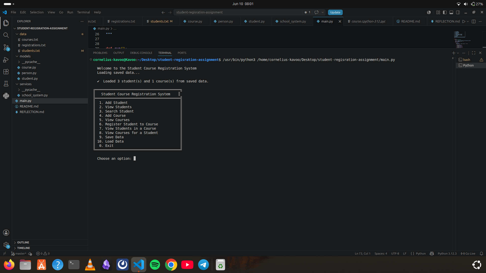
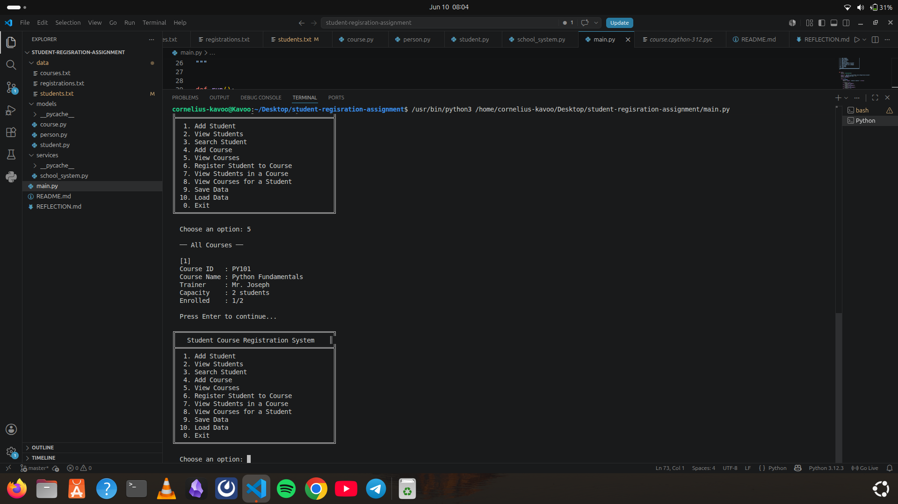
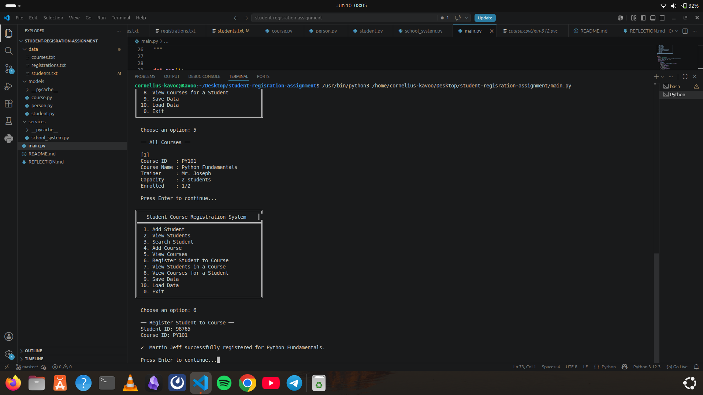
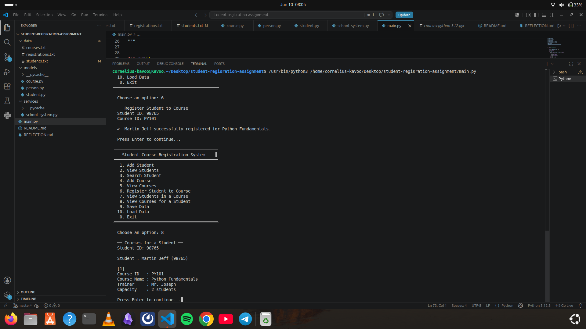
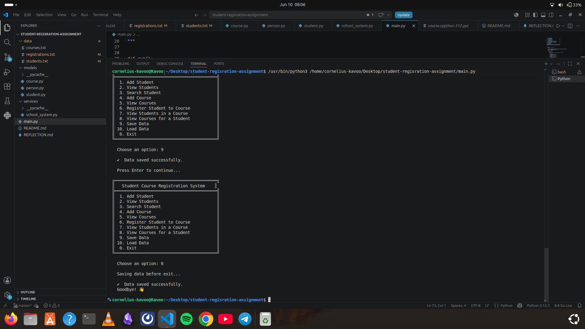

# Student Course Registration System

A simple command-line application for managing student enrollments and course registrations at a school.

## Features

- **Student Management**: Add, view, and search for students
- **Course Management**: Add and view available courses
- **Course Registration**: Register students for courses
- **Data Persistence**: Save and load all data from text files
- **Course Queries**: View students enrolled in a course or courses taken by a student

## How to Run

```bash
python main.py
```

Follow the interactive menu to manage students and courses.

## Project Structure

- `main.py` - Entry point with the main menu
- `models/` - Data models for Person, Student, and Course
- `services/` - SchoolSystem class that handles all business logic
- `data/` - Text files for persistent data storage (students, courses, registrations)

## Screenshots

### Main Menu


### Available Courses


### Adding Students


### Student Added to Course


### Confirming Student Registration


### Saving and Exiting


## Requirements

- Python 3.6+
